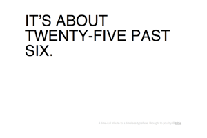
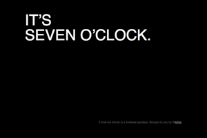

[helvetictoc](helvetictoc.com)
===============
A time-full tribute to a timeless typeface.
-------------------------------------------

helvetictoc is [my](https://github.com/tobie) entry to the [10K apart contest](http://10k.aneventapart.com/).

It displays humanized time set in Helvetica.

## Technical details:

helvetictoc doesn't rely on any external scripts.

~~It's however using [CommonJS modules](http://wiki.commonjs.org/wiki/Modules/1.1) which are concatenated using [modulr](http://github.com/codespeaks/modulr).~~

The JS source file is found in `main.js`.

This hopefully proves proper code organisation doesn't trump file size: the included modulr JS script is just above 3kb _before minification_.

The ~~[src code](http://github.com/tobie/helvetictoc)~~ [modified source code](https://github.com/bign8/helvetictoc) is available on github.

## Screen Shots!
  
  

